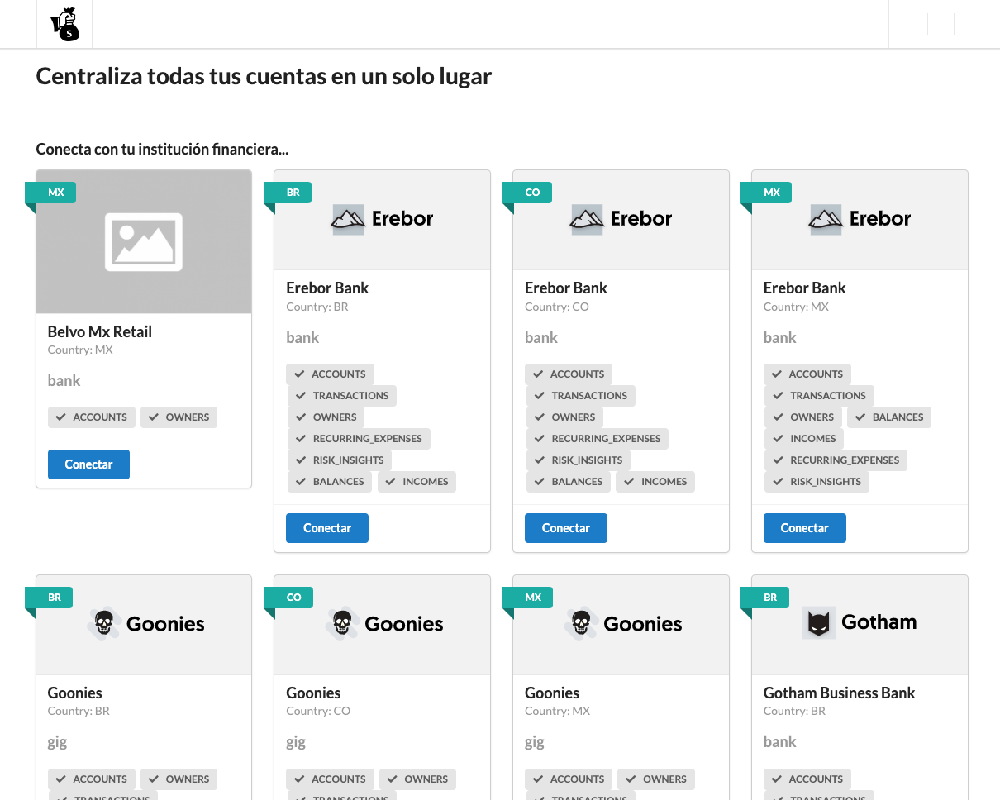
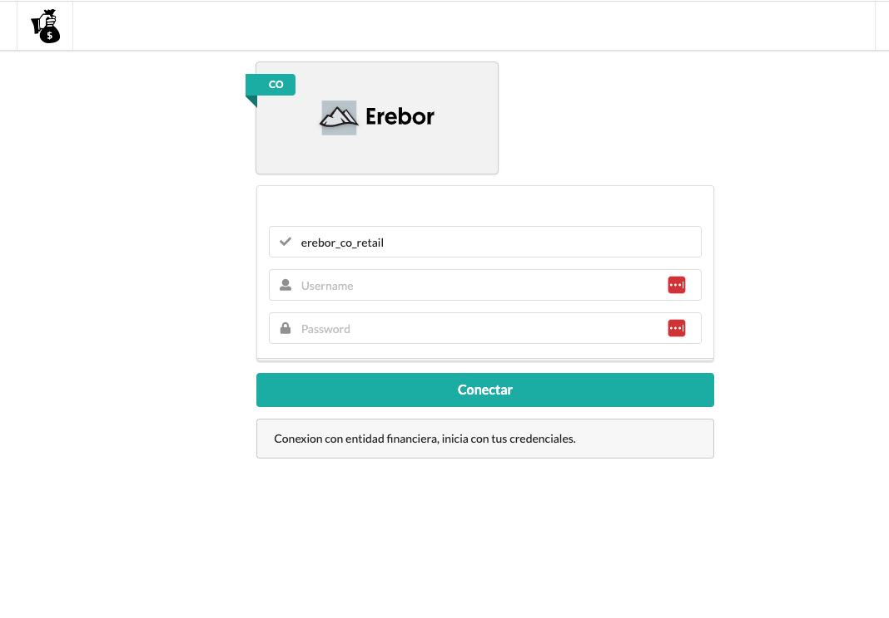

# Centralis

Centralis, una app que te pertime tener tus cuentas bancarias en un solo lugar. Conecta con los diferentes bancos y ten control de los movimientos que realizaste. 

Elije tu endidad bancaria, ingresa tus credenciales y obten todos tus movimientos. 

Registrate para tener mas control y agregar todas las entidades finacieras disponibles.
#
## Entidades finacieras disponibles



#
## Conectando con entidad financiera



#
## Todas las transaciones en un solo lugar


### Instalación 🔧 

Para realizar la instalación se deben seguir los siguientes pasos,

_Clonación del repositorio_

```shell
git clone git@github.com:dickson7/register_coink.git
```

_Ingresamos en el directorio del repositorio clonado, y ejecutamos el siguiente comando para habilitar el entorno virtual_

```shell
python3 -m venv env
```

_Activamos el entorno virtual_

```shell
source env/bin/activate
```

_Instalamos las dependencias con pip_

```shell
(env)$ pip3 install -r requirements.txt
```

_Lanzamos migraciones_

```shell
(env)$ python3 manage.py makemigrations
(env)$ python3 manage.py migrate
```

_Creamos un superusuario_
```shell
(env)$ python manage.py createsuperuser
```

_Como último paso realizamos la ejecución del servidor_

```shell
(env)$ python3 manage.py runserver
```
